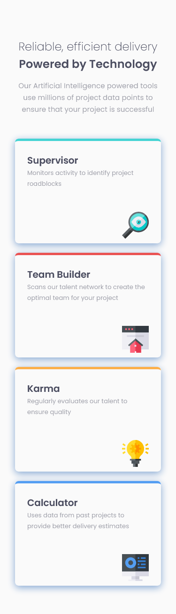
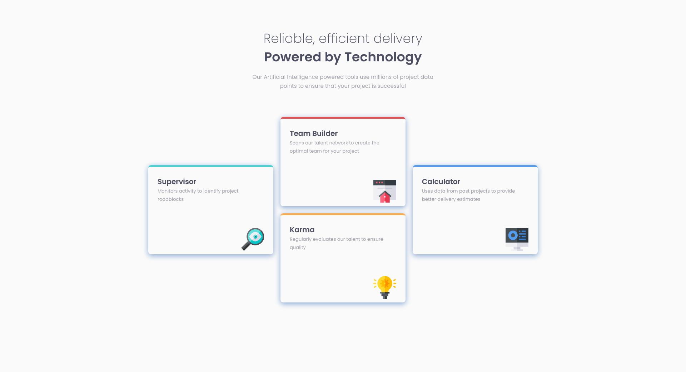

# Four Card Feature Section Master

This project is a responsive web interface designed with CSS Grid to organize cards in a dynamic and adaptable grid layout. It implements a flexible structure that adjusts card placement across different grid areas, optimizing the user experience on both mobile and desktop devices.

## Table of contents

- [Overview](#overview)
  - [The challenge](#the-challenge)
  - [Screenshot](#screenshot)
  - [Links](#links)
- [My process](#my-process)
  - [Built with](#built-with)
  - [Installation Steps](#installation-steps)
  - [Useful resources](#useful-resources)
- [Author](#author)

## Overview

### The challenge
The challenge involved creating a responsive web layout using CSS Grid to display cards in a 3x3 grid. The cards needed to adapt to various screen sizes, with specific positioning and alignment for mobile and desktop views. The goal was to ensure that the layout remained visually appealing and functional across devices, with the cards occupying designated areas and adjusting their placement accordingly.

### Screenshot

- Phone Device

- Desktop Device      

_If the images are not visible, please check the file path or ensure the screenshots exists._

### Links

- [Live Site](https://four-card-feature-section-master-pi-nine.vercel.app/) - View the live version.

## My process

### Built with

- Mobile-first workflow
- [Sass](https://nextjs.org/docs/app/building-your-application/styling/sass) - Sass for styling
- [React](https://reactjs.org/) - TS library
- [Next.js](https://nextjs.org/) - React framework

### Installation Steps

  #### 1. Clone the repository (if you haven't already)
    git@github.com:nmelissarp/four-card-feature-section-master.git
  #### 2. Navigate to the project folder
    cd four-card-feature-section-master
  #### 3. Install dependencies
    npm install
  #### 4. Run the development server
    npm run dev
  #### 5. Verify the application Open your browser and navigate to http://localhost:3000 to ensure everything is working as expected.

### Useful resources

[CSS Grid Layout Guide](https://css-tricks.com/snippets/css/complete-guide-grid/) - CSS-Tricks - Complete Guide to Grid: A comprehensive guide that explains the entire CSS Grid layout system, including how to use grid-column and grid-row to organize content into rows and columns.
[An Interactive Guide to CSS Grid](https://www.joshwcomeau.com/css/interactive-guide-to-grid/) - Josh W. Comeau - Interactive Guide to CSS Grid: An interactive, visual guide that helps users understand CSS Grid by demonstrating how grid items are placed within a grid container, with clear examples
[CSS grid layout](https://developer.mozilla.org/en-US/docs/Learn_web_development/Core/CSS_layout/Grids) - MDN Web Docs - CSS Grid Layout: The official documentation from Mozilla, providing a detailed explanation of the CSS Grid system, including syntax and real-world use cases.

## Author

- [Melissa Ramírez](https://www.linkedin.com/in/nmelissarp/) - Developer and enthusiast of web development, always learning and experimenting with new technologies.